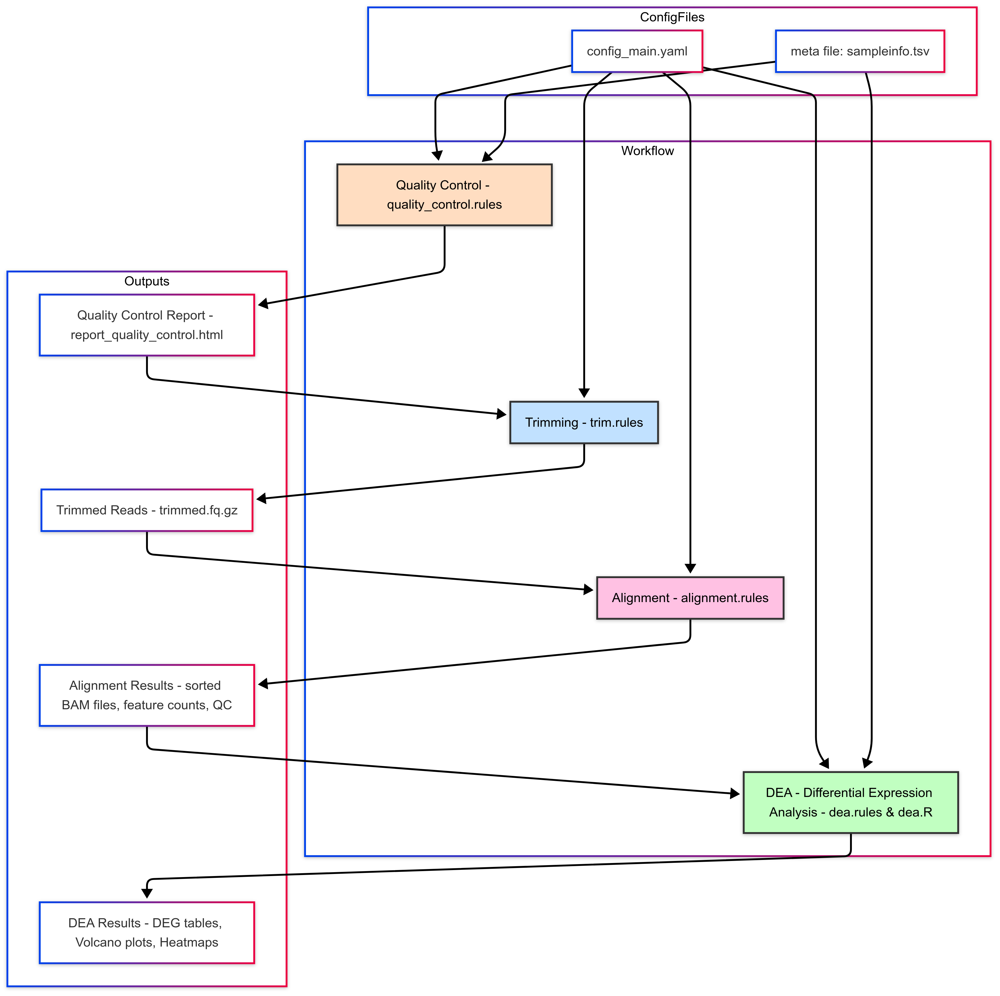

# RNA-Seq Data Analysis Pipeline

Welcome to the documentation for the RNAseq data analysis pipeline. The pipeline automates the processing of RNA sequencing data, starting from raw reads through to differential expression analysis (DEA).

This documentation includes:

- An overview of the pipeline.

- Step-by-step details of each workflow stage.

- A workflow diagram for better understanding.

## Usage

To run the pipeline, execute the `main.py` script on the login node (in screen) 

```bash
python main.py
```

The pipeline will load the configuration from `configs/config_main.yaml` that needs to be manually modified, execute the Snakemake workflows, and generate the output files and directories.

 
## Pipeline Overview

  

 The pipeline consists of the following key steps:

1. **Quality Control (QC)**: Assess the quality of the raw fastq files using FastQC.
2. **Trimming**: Trim adapter sequences and low-quality bases from the reads using Trimmomatic.
3. **Post-Trimming QC**: Perform quality control on the trimmed reads using FastQC.
4. **Alignment**: Align the trimmed reads to a reference genome using STAR.
5. **Alignment QC**: Assess the quality of the alignments using Qualimap.
6. **Feature Counting**: Count the number of reads aligned to each gene using featureCounts (subread).
7. **Differential Expression Analysis (DEA)**: Identify differentially expressed genes between conditions using DESeq2.


## Configuration

The pipeline is configured using YAML files located in the `configs/` directory:

- `config_main.yaml`: Contains the main configuration parameters for the pipeline, such as input/output paths, tool paths, and sample metadata.

`PROJECT:` novogene_researchgroup_user_date<br>
`TOOLSPATH:` /opt/software/miniconda3/bin<br>
`READSPATH:` /home/user/samples<br>
`METAFILE:` /home/user/sampleinfo.tsv<br>
`END:` pair  # "pair" <br>
`NCORE:` 4 <br>
`READLENGTH:` 150 <br>
`ORGANISM:` Mouse <br>
`GENOME:` /opt/NGS/References/mm10/star/v102/Mus_musculus.GRCm38.dna.primary_assembly.fa <br>
`ANNOTATION:` /opt/NGS/References/mm10/star/v102/Mus_musculus.GRCm38.102.gtf <br>
`GENOMEINDEX:` /opt/NGS/References/mm10/star/v102/star_rl150/ <br>
`ATTRIBUTE:` gene_id   <br>
`ADAPTERFILE:` /opt/software/miniconda3/share/trimmomatic/adapters/TruSeq3-PE-2.fa <br>
`ORIENTATION:` 0 <br>

(# -s 0 unstranded, 2 RF/fr-firststrand stranded (dUTP), 1 FR/fr-secondstrand stranded (Ligation))
- example of `sampleinfo.tsv`

```
sample	group	deause
sample1 control yes
sample2 control yes
sample3	control yes
sample4 patient yes
sample5 patient yes
sample6 patient yes
```
**Note**: in case one of the sample was found to be an outlier after the analysis it can be maked as `no` in deause column. Next, rename the output folder `results/dea` and rerun the pipeline (that will generate a new `results/dea`).  

## Scripts

The main scripts that drive the pipeline are:

- `main.py`: The main script that manages the subworkflows for RNA-Seq data analysis. It loads the main configuration file, verifies the reference genome and annotation, and executes the Snakemake workflows for processing files and differential expression analysis.

- `dea.R`: The script running the diffrential gene expression in R 


## Analysis Steps

### 1. Quality control

The `quality_control.rules` workflow performs the following steps:

- Copies raw reads from the specified input path.

- Runs `FastQC` for quality assessment.

- Generates a summary report using `MultiQC`.

---

**Configuration**:


- Input path for raw reads: `READSPATH` (specified in `configs/config_main.yaml`).

- Output path for QC reports: `FINALOUTPUT/fastqc`.

---
**Rule: `getReads`**:
Copies raw reads to the intermediate directory 

**IMPORTANT NOTE!!!**: Make sure the wildcards corresponds to your files names!

```
rule getReads:
    output:
        read1 = temp(intermediate_path + "/reads/{sample}_read1.fastq.gz"),
        read2 = temp(intermediate_path + "/reads/{sample}_read2.fastq.gz")
    shell:
        """
        cp -alf {params.input_path}/{wildcards.sample}*_1.fq.gz {output.read1}
        cp -alf {params.input_path}/{wildcards.sample}*_2.fq.gz {output.read2}
        """
```


Output:

    Per-sample FastQC reports: {sample}_read1_fastqc.html and {sample}_read2_fastqc.html
    MultiQC summary report: report_quality_control.html.

### 2. Reads trimming and QC post-trimming

The `trim.rules` workflow performs the following steps:

- Copies reads to an intermediate directory.

- Runs `Trimmomatic` for trimming PE, or `bbduk` for SE (Lexogen).

- Generates post-trimming quality control reports with `FastQC`.


**Configuration**:

- Adapter file: `ADAPTERFILE`.

- Trimming parameters: `LEADING`, `TRAILING`, `SLIDINGWINDOW`, `MINLEN`.


---
**Rule: `trim`**:

#### 2.a. Reads trimming PE

Runs `Trimmomatic` to trim reads.


<div class="warning">
ATTENTION!!!  Make sure the wildcards correspond to your file names!
</div>


```
rule trim:
    input:
        read1 = intermediate_path + "/reads/{sample}_read1.fastq.gz",
        read2 = intermediate_path + "/reads/{sample}_read2.fastq.gz"
    output:
        read_trim_read1 = intermediate_path + "/{sample}_R1_val_1.fq.gz",
        read_trim_read2 = intermediate_path + "/{sample}_R2_val_2.fq.gz"
    shell:
        """
        {config[TOOLSPATH]}/trimmomatic PE -phred33 -threads {threads} {input.read1} {input.read2} \
        {output.read_trim_read1} {output.read_trim_read2} ILLUMINACLIP:{adapter_file}:2:30:10 SLIDINGWINDOW:4:15 MINLEN:36
        """
```

Output:

    Trimmed reads: {sample}_R1_val_1.fq.gz and {sample}_R2_val_2.fq.gz.
    
    MultiQC summary report for trimming: report_quality_control_after_trimming.html.

    
#### 2.b. Reads trimming SE
    
    
```
rule trim:
    input:
        read1 = pathin + "/reads/{sample}_read1.fastq.gz"
    output:
        trim_read1 = intermediate_path + "/{sample}_trimmed.fq.gz",
        stats_trim_read1 = final_path + "/fastQC_after_trimming/{sample}_bbduk.contaminants.txt"
    params:
        outputpath = intermediate_path
    threads:
        4
    shell:
       """
       zcat {input.read1} | {config[TOOLSPATH]}/bbduk.sh in=stdin.fq out=stdout.fq ref={adapter_files}/polyA.fa,{adapter_files}/truseq.fa k=13 ktrim=r useshortkmers=t mink=5 qtrim=r trimq=10 minlength=20 int=f t={threads} ziplevel=9 stats={output.stats_trim_read1}  | gzip >{output.trim_read1}
       """
```

Output:

    Trimmed reads: {sample}_R1_val_1.fq.gz.
    
    MultiQC summary report for trimming: report_quality_control_after_trimming.html.

    
### 3. Alignment, alignment QC and feature counting

The `alignment.rules` workflow performs the following steps:

- Aligns reads to the genome.

- Filters (uniquely mapped reads) and sorts BAM files.

- Counts reads that align to annotated features (e.g., genes or exons) using FeatureCounts.

- Generates alignment quality control reports with `Qualimap`.

  
#### 3.a Alignment PE
  
```
rule alignment:
    input:
        read1 = intermediate_path + "/reads/{sample}_read1.fastq.gz",
        read2 = intermediate_path + "/reads/{sample}_read2.fastq.gz"
    output:
        bam = final_path + "/bams/{sample}.bam"
    params:
        index = config["GENOMEINDEX"],
        bamprefix = intermediate_path + "/bamFile/{sample}_",
        baminit = intermediate_path + "/bamFile/{sample}_Aligned.sortedByCoord.out.bam",
        annotation = config["ANNOTATION"],
        sampleid = "{sample}"
    threads:
        config["NCORE"]
    shell:
        """
        {pathtool}/STAR --runThreadN {threads} --genomeDir {params.index} \
        --readFilesIn {input.read1} {input.read2} \
        --outSAMtype BAM SortedByCoordinate \
        --outSAMattrRGline ID:{params.sampleid} SM:{params.sampleid} \
        --outFileNamePrefix {params.bamprefix} && \
        {pathtool}/samtools view -bq 255 {params.baminit} -o {output.bam}
        """
```        


#### 3.a Alignment SE
  
```
rule alignment:
    input:
        read1 = pathin + "/trim/{sample}_trimmed.fq.gz"
    params:
        index = config["GENOMEINDEX"],
        bamprefix = intermediate_path + "/{sample}_",
        annotation = config["ANNOTATION"],
        sampleid = "{sample}",
        outputpath = intermediate_path
    output:
        baminit = intermediate_path + "/{sample}_Aligned.sortedByCoord.out.bam"
    shell:
       """
       {config[TOOLSPATH]}/STAR  --runThreadN {config[NCORE]} --genomeDir {params.index} --readFilesIn {input.read1} --outFilterType BySJout --outFilterMultimapNmax 20 --alignSJoverhangMin 8 --alignSJDBoverhangMin 1 --readFilesCommand zcat --outFilterMismatchNmax 999 -outFilterMismatchNoverLmax 0.1 --alignIntronMin 20 --alignIntronMax 1000000 --alignMatesGapMax 1000000 --outSAMattributes NH HI NM MD  --outSAMtype BAM SortedByCoordinate --outFileNamePrefix {params.bamprefix}
       """
```


**NOTE** As specified by Lexogen

https://www.lexogen.com/wp-content/uploads/2021/05/015UG108V0311_QuantSeq-Data-Analysis-Pipeline_2021-05-04.pdf


```
rule featureCount:
    input:
        bam = final_path + "/bams/{sample}.bam",
        annotation = config["ANNOTATION"]
    output:
        countreads = final_path + "/countFile/{sample}_count.tsv",
        count_summary = final_path + "/countFile/{sample}_count.tsv.summary"
    threads:
        config["NCORE"]
    shell:
        """
        {pathtool}/featureCounts -p -T {threads} -t exon -g {config[ATTRIBUTE]} \
        -s {config[ORIENTATION]} -a {input.annotation} -o {output.countreads} {input.bam} && \
        tail -n +3 {output.countreads} | cut -f1,7 > temp.{wildcards.sample} && \
        mv temp.{wildcards.sample} {output.countreads}
        """
```


```
rule alignmentQC:
    input:
        bam = final_path + "/bams/{sample}.bam"
    output:
        bamqc = directory(final_path + "/alignmentQC/{sample}_BAMqc")
    shell:
        """
        {config[TOOLSPATH]}/qualimap bamqc -bam {input.bam} -nr 1000 \
        --java-mem-size=10G -nt {config[NCORE]} -outdir {output.bamqc}
        """
```        
   
   Additional explanations:
   
   
   
### 4. Differential Expression Analysis

The `dea.rules` workflow performs differential expression analysis using DESeq2. It includes the following steps:

**DEA**: Performs differential expression analysis using the `dea.R` script.

#### dea.R Script

The pipeline includes an R script for differential expression analysis:

- `dea.R`: Performs differential expression analysis using DESeq2. It takes the count files generated by featureCounts as input, normalizes the counts, performs differential expression analysis between the specified control and treatment groups (in the config file), and generates various plots and results files.

In detail:


1. **Generate DESeqDataSet (`generate_dds` function):**
   - Read the count files specified in the `filelist` and combine them into a count table.
   - Filter out genes specified in `exclude.genes` if provided.
   - Select only protein-coding genes if `protein_coding_only` is set to "YES".
   - Remove ribosomal genes, mitochondrial genes, and genes on the Y chromosome.
   - Create a DESeqDataSet object using the count table and sample information.
   - Estimate the size factors for normalization and save the normalized counts.
   - Output files:
     - `table_input_gene_counts.tsv`: Raw count table.
     - `library_normalized_gene_counts.tsv`: Normalized count table.

2. **Generate All Samples Plots (`generate_allsamples_plots` function):**
   - Perform variance stabilizing transformation (VST) on the DESeqDataSet object.
   - Plot a PCA of the top 1000 most variable genes.
   - Calculate sample distances using Euclidean distance and plot a heatmap of the sample distances.
   - Output files:
     - `plots/Cond-PC1-PC2_top1000.png`: PCA plot of the top 1000 most variable genes.
     - `plots/SamplesDist_Euclidean.png`: Heatmap of sample distances.

3. **Perform Differential Expression Analysis (`DEA` function):**
   - Take a control group, a treatment group, the DESeqDataSet object, and the VST object as inputs.
   - Perform differential expression analysis using DESeq2's `results` function.
   - Apply independent hypothesis weighting (IHW) to adjust the p-values.
   - Save the differential expression results and significantly differentially expressed genes (DEGs) to files.
   - Generate volcano plots and heatmaps for the DEGs.
   - Generate individual gene plots for the top differentially expressed genes and any additional genes specified in `plot.genes.extra`.
   - Output files:
     - `vst_normalized_gene_counts.tsv` or `vst_normalized_gene_counts.txt`: VST normalized count table.
     - `LogRatios_<control>_<treat>.tsv`: Differential expression results table.
     - `SignifDiffExpr_<control>_<treat>.tsv`: Significantly differentially expressed genes table.
     - `top20most_expressed_genes.tsv`: Top 20 most expressed genes.
     - `plots/DEG_volcanoplot_enhanced_<control>_<treat>.png`: Volcano plot of DEGs.
     - `plots/DEG_heatmap_<control>_<treat>.png`: Heatmap of DEGs.
     - `plots/plots_extra/<gene_symbol>_<gene_id>.png`: Individual gene plots for additional genes specified in `plot.genes.extra`.
     - `plots/plots_deg/<gene_symbol>_<gene_id>.png`: Individual gene plots for the top differentially expressed genes.

4. **Configuration and Setup:**
   - Load the configuration file `configs/config_main.yaml` and extract various parameters and settings.
   - Read the metadata file specified in `sampleinfo.tsv` and extract sample information, group information, and covariates.

5. **Execute the Analysis:**
   - Call the `generate_dds` function to generate the DESeqDataSet object and perform normalization.
     - Output file:
       - `deasession.RData`: R data file containing the DESeqDataSet object.
   - Call the `generate_allsamples_plots` function to generate plots for all samples.
   - Iterate over each comparison specified in the configuration (`controls` and `treats`) and call the `DEA` function to perform differential expression analysis for each comparison.

6. **Print Session Information:**
   - Print the session information for reproducibility purposes.

   
## Output files pipeline

The pipeline generates various output files and directories, including:

- `fastqc/`: Contains the FastQC reports for the raw reads.
- `fastqc_after_trimming/`: Contains the FastQC reports for the trimmed reads.
- `bams/`: Contains the aligned BAM files.
- `countFile/`: Contains the feature count files.
- `alignmentQC/`: Contains the alignment quality control reports generated by Qualimap.
- `multiqc html` 
- `dea/`: Contains the differential expression analysis results, including normalized counts, PCA plots, sample distance plots, and differential expression tables.


## Output Files for DEA with DESeq2

The `dea.R` script generates various output files throughout the differential expression analysis process:

Normalized count tables:

  - `table_input_gene_counts.tsv`: Raw count table.
  - `library_normalized_gene_counts.tsv`: Normalized count table.
  - `vst_normalized_gene_counts.tsv` or `rlg_normalized_gene_counts.txt`: VST normalized count table.

Differential expression results:

  - `LogRatios_<control>_<treat>.tsv`: Differential expression results table.
  - `SignifDiffExpr_<control>_<treat>.tsv`: Significantly differentially expressed genes table.
  - `top20most_expressed_genes.tsv`: Top 20 most expressed genes.

Plots:

  - `plots/Cond-PC1-PC2_top1000.png`: PCA plot of the top 1000 most variable genes.
  - `plots/SamplesDist_Euclidean.png`: Heatmap of sample distances.
  - `plots/DEG_volcanoplot_enhanced_<control>_<treat>.png`: Volcano plot of DEGs.
  - `plots/DEG_heatmap_<control>_<treat>.png`: Heatmap of DEGs.
  - `plots/plots_extra/<gene_symbol>_<gene_id>.png`: Individual gene plots for additional genes specified in `plot.genes.extra`.
  - `plots/plots_deg/<gene_symbol>_<gene_id>.png`: Individual gene plots for the top differentially expressed genes.

R data file:

  - `deasession.RData`: R data file containing the DESeqDataSet object.


The specific output files generated depend on the configuration settings and the comparisons specified. 
The output files are saved in the designated output directory (`output.path`) and its subdirectories (`plots/`, `plots/plots_extra/`, `plots/plots_deg/`).

## DESeq2 Differential Gene Expression Analysis Output Table 

`LogRatios_<control>_<treat>.tsv` and it's subset file `SignifDiffExpr_<control>_<treat>.tsv` (containing only the genes with padj <0.05) 

### Key Columns in the DESeq2 Output Table

#### baseMean:

**Description:**
The average normalized counts across all samples, representing the overall expression level of the gene.

**Use:**
Helps identify highly or lowly expressed genes across all samples.

**Note**
Consider genes with BaseMean <50 as genes with low expression 


#### log2FoldChange:


**Description:**
The log2-transformed fold change in expression between two conditions (e.g., treatment vs. control).

**Use:** 
Indicates the magnitude and direction of change:
	- Positive values: Upregulation in the treatment group.
	
	- Negative values: Downregulation in the treatment group.

#### lfcSE:

**Description:**
The standard error of the log2FoldChange.

**Use: **
Provides an estimate of the uncertainty in the fold change.


#### stat:

**Description:**
The Wald test statistic, calculated as log2FoldChange / lfcSE.

**Use:** Used to compute the p-value.

#### pvalue:

**Description:**
The raw p-value from the Wald test, indicating the statistical significance of the differential expression.

**Use:** Identifies statistically significant DEGs (typically < 0.05).

#### padj:

**Description:**
The adjusted p-value (e.g., Benjamini-Hochberg correction) to control for multiple testing.

**Use:**
Reduces false positives; commonly used threshold is padj < 0.05.


#### gene (optional):

**Description:**
The gene identifier (e.g., gene name, Ensembl ID, or other annotation).

**Use:**
Links DEGs to their functional annotation.


## Additional explanations for DEA output files

**Dea (differential expression analysis)**

`LogRatios` and `SignifDiffExpr` files: 

The filenames indicate the reference condition—for example, `SignifDiffExpr_CON_PAT.tsv` means that a gene with a positive log2 fold change (log2FC) is upregulated in the Control sample group. To use the Patient as reference, just multiply all the value in column log2FC with `-1`.


`Table_input_gene_counts.tsv:`

This file contains the raw gene count data used as input for DESeq2. The counts for each sample were generated using the featureCounts function from the Subread tool.


`library_normalized_gene_counts.tsv:` 

This file contains gene count data normalized using DESeq2’s size factors to account for differences in library sizes (values used in the DEGenes plots)


 **Plots:**

 - PCA_plot of the samples

 - Volcanoplot of DEGs (differentially expressed genes) for every comparison

 - Heatmap of DEGs for every comparison (verify the sample grouping in the dendrogram!)

 - plots_deg folder: violin plot for every DEGs, viewed per sample group 


## Functional enrichment with Webgestalt 

### Overrepresentation analysis

For Overrepresentation analysis, you click on the *“Over Representation Analysis”*, select organism and database (most common: geneontology -> Biological Processes nonredundant )
  
In the input ID list box you add the column of the gene symbols in the `SignifDiffExpr_*.tsv` file.
 
**ATTENTION!!!** Unless otherwise specified, you select the genome protein_coding genes at *“Select Reference Set”*.


### GSEA

For Gene set Enrichment analysis, you click on the *“GeneSet Enrichment Analysis”*,  select organism and database (most common: geneontology -> Biological Processes nonredundant).

**Instructions for Preparing the Input File:**

**Open the LogRatios_*.tsv File:** 

Use Excel or Google Sheets (recommended, especially if the log2FoldChange values appear unusual, e.g., with multiple dots like -3.989.094.943).

**Sort the Data:**
Sort the log2FoldChange column in descending order, from the most positive to the most negative values.


**Prepare the Input for WebGestalt:**

Use the gene name and log2FoldChange columns from the LogRatios_*.tsv file as the input for WebGestalt.

(Ensure the format matches the example shown in the demo data from webgestalt.)


## Consider Improvements to the RNA-Seq Pipeline

- **Incorporate gender verification**:  
  Extend the R script to include checks for known genes that are highly expressed on chromosomes X and Y. This helps confirm the reported gender of the experimental samples.

- **Assess strand specificity**:  
  Determine the strandness of the RNA-seq data from the initial FASTQ files if not already known. Accurate strand information is required for correct read assignment by tools such as `featureCounts` (via the `-s` parameter).

- **Include all mapped reads**:  
  Consider including both uniquely and multi-mapped reads in the analysis, depending on your experimental design and goals. This may improve coverage for repetitive or duplicated gene regions.

- **Customize `featureCounts` parameters**:  
  Fine-tune settings for overlapping features, multimapping behavior, and read assignment to better suit the characteristics of your dataset.

- **Optimize STAR alignment parameters**:  
  Review and adjust STAR alignment settings to enhance mapping efficiency and accuracy, especially with respect to read length, mismatch allowance, insert size, and splice junction handling.
  
## Dependencies

The pipeline requires the following dependencies:

    `Python`
    `Snakemake`
    `R` with mentioned libraries in the script
    `FastQC`
    `MultiQC`
    `Trimmomatic`
    `STAR`
    `samtools`
    `subread featureCounts`
    `Qualimap`
    


